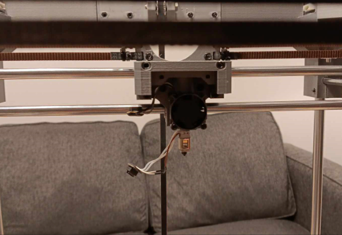

This is a 225x225 build volume printer based on the rook 180 by Rolohaun, 
that uses the BambuLabs P1P hotend in place of the stock hotend.
It's a modification of the work done by woodknight and Kanrog for the rook 180 turned.

It uses an Ender 3 Bed

 [https://github.com/WoodKnight58/Rook-180-Turned](url)

[https://www.printables.com/model/365707-rook-235-225-mod](url)

